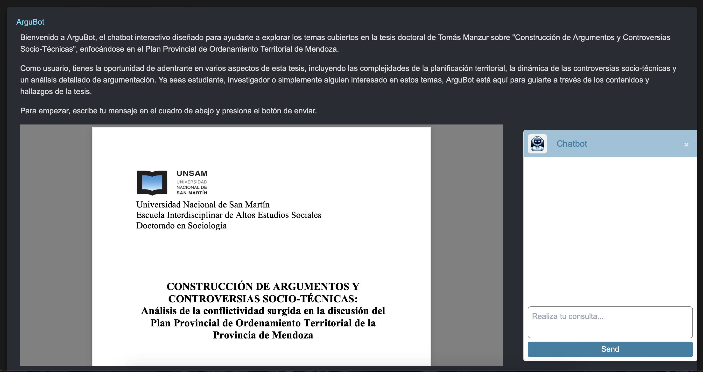

# ArguBot: Chatbot for Sociotechnical Argument Analysis

ArguBot is an innovative chatbot derived from Tomás Manzur's doctoral thesis titled "Construction of Arguments and Socio-Technical Controversies." It offers an interactive platform to delve into the insights of the Plan Provincial de Ordenamiento Territorial of Mendoza.

This chatbot is engineered to facilitate the exploration and comprehension of the complexities encapsulated within the thesis. It allows users to engage with the research content, providing detailed access to information and analyses of the arguments and socio-technical controversies associated with the PPOT.

ArguBot leverages cutting-edge AI technologies and methodologies, featuring:

- **Embedding Model**: Utilizes advanced embedding models to convert textual input into numerical vectors, capturing the essence and subtleties of semantics.
- **Retrieval-Augmented Generation (RAG)**: Employs a hybrid model that combines retrieval-based and generative models, enhancing the chatbot's ability to provide precise, context-aware responses.
- **Customized Thesis Content**: Tailored specifically to navigate the thesis's subject matter, including territorial planning and socio-technical disputes.
- **Privacy and Security**: Designed with a strong emphasis on user privacy and data security.

## Features
- **Content Query**: Instant access to specific thesis-related content.
- **Argument Analysis**: Engage in interactive analysis of key arguments.
- **Conflict Contextualization**: Uncover the socio-technical conflict layers in Mendoza's territorial planning.

## User Interface Preview

Get a glimpse of ArguBot's user-friendly interface, designed for an engaging and interactive user experience.

The interface provides a clean and intuitive environment for users to interact with the chatbot and explore the thesis's topics. With a straightforward layout, accessing information and conducting analyses is both efficient and enjoyable.

## Installation and Setup
ArguBot has transitioned from a Jupyter Notebook interface to a Flask-based web UI for an enhanced user experience.

To set up and run ArguBot, follow these instructions:

1. **Clone the repository** to your local machine.
2. **Install the required dependencies** listed in `requirements.txt` using the command `pip install -r requirements.txt`.
3. **Set your Google API Key** as an environment variable named `GOOGLE_API_KEY`.
4. **Run the Flask application** by executing `python app.py` in your terminal.

After these steps, ArguBot's UI will be accessible via your web browser at `http://localhost:5000/`.

## Usage
Navigate to `http://localhost:5000/` in your web browser to interact with ArguBot. Enter your queries related to the thesis, and ArguBot will respond with information and analysis based on the thesis content.

## Sample User Interactions with ArguBot
- **User**: "Can you explain the main conflict in the Mendoza Territorial Planning Plan?"
- **ArguBot**: "The main conflict revolves around water resource utilization and the positioning of different social actors regarding its management and distribution in territorial planning."

- **User**: "What are the socio-technical controversies discussed in the thesis?"
- **ArguBot**: "The thesis discusses controversies such as the impact of water management policies on social groups and the urban development versus agricultural preservation debate in Mendoza."

- **User**: "How was the qualitative research approach applied in the thesis?"
- **ArguBot**: "The qualitative research involved discourse analysis from stakeholder interviews, official document reviews, and public hearing records to understand various perspectives and arguments."

- **User**: "What were some key findings about water usage in Mendoza?"
- **ArguBot**: "A critical finding was that water usage is central to territorial disputes, reflecting power dynamics and illustrating how water scarcity influences social and economic activities."

These interactions exemplify ArguBot's capability to deliver insightful and contextually relevant responses, making it an invaluable tool for navigating through the intricate themes of the thesis.
